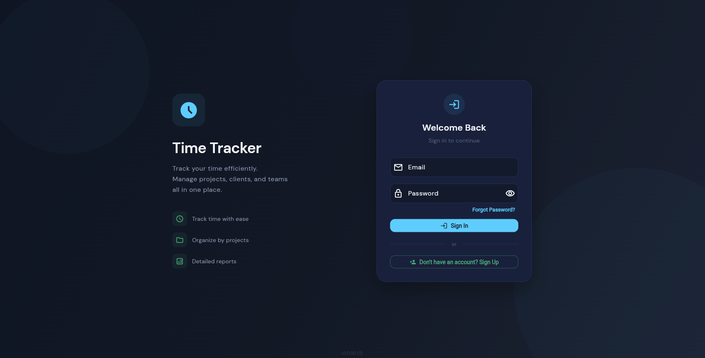
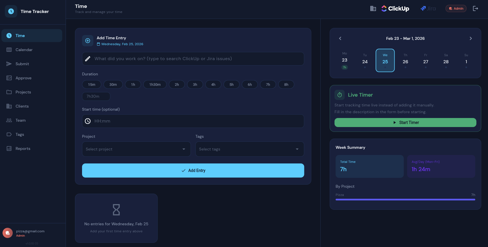
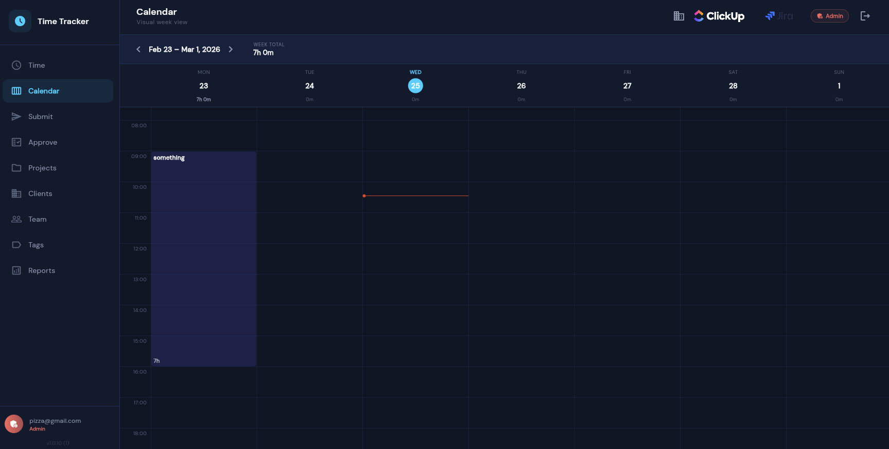
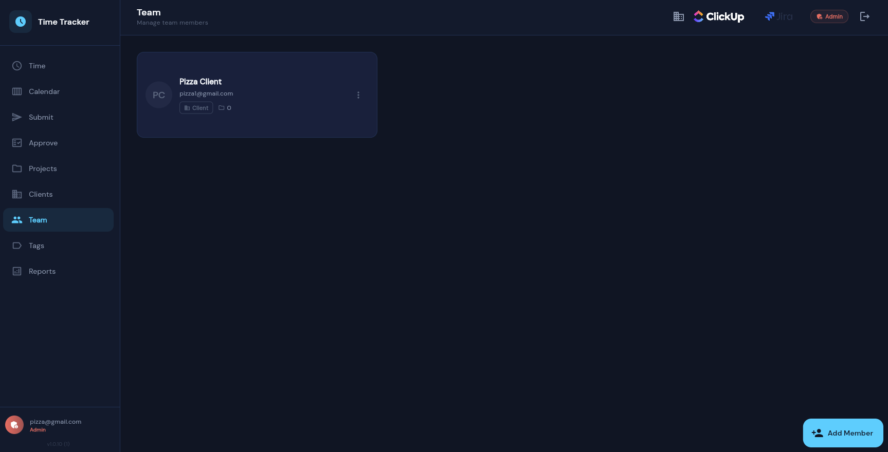
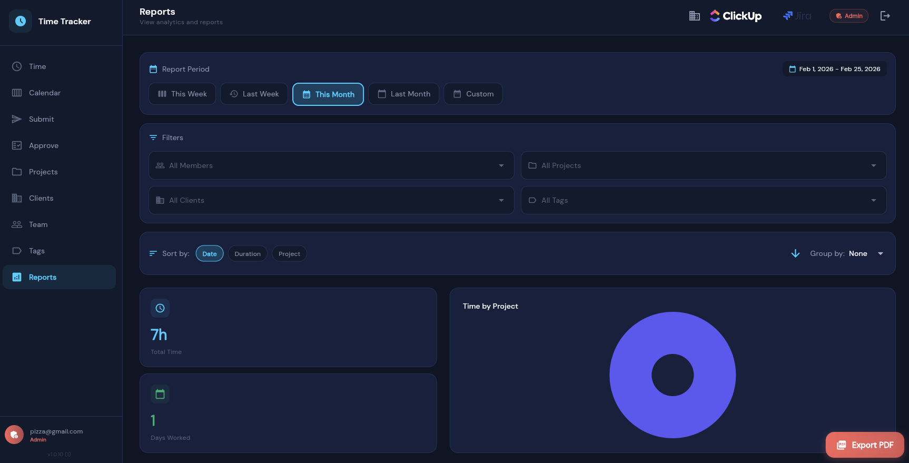
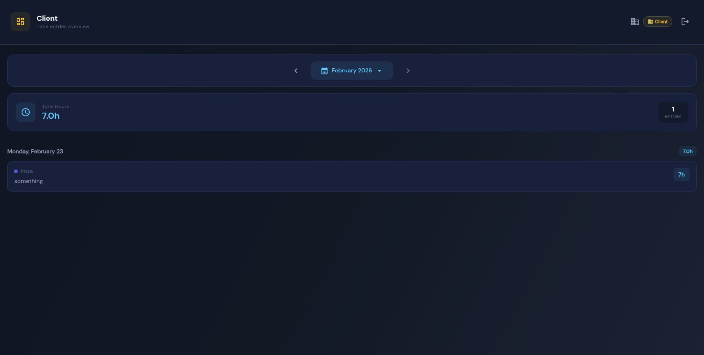
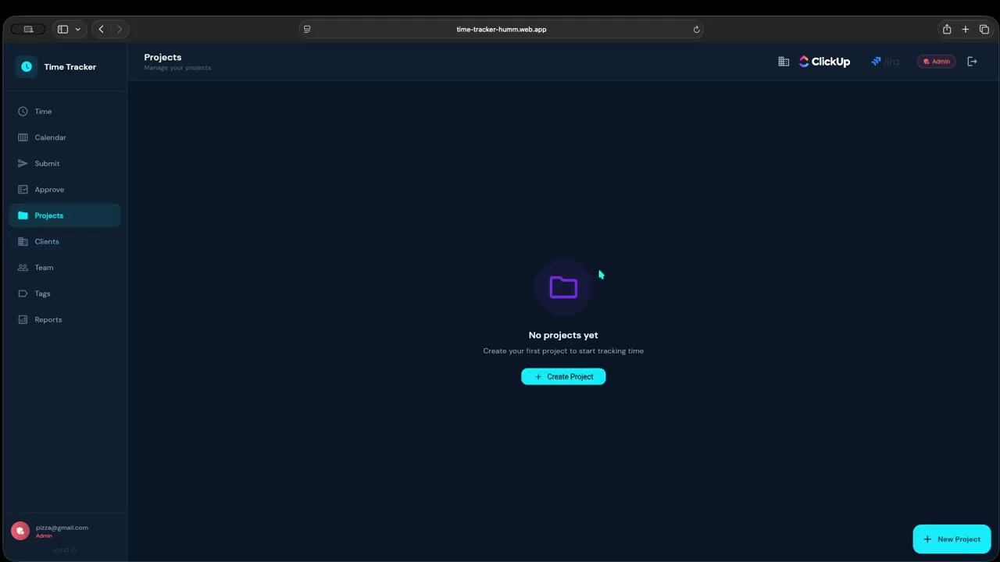

# Time Tracker

Track team hours with clarity, speed, and accountability.
Time Tracker helps teams log work, managers approve hours, and clients see exactly what was delivered.

## Why Teams Choose Time Tracker

- faster weekly time approval with a simple submit-and-approve flow
- cleaner client communication with role-based, approved-only visibility
- structured work tracking across organizations, clients, and projects
- open-source foundation with production-ready Firebase architecture

## Managed Deployment (Paid)

Want this live in production without handling infrastructure yourself?
Hummlab can deploy and configure Time Tracker on Firebase for your team.
Contact Hummlab to discuss scope, timeline, and pricing.

## Product Screenshots

| Login                         | Dashboard                         | Calendar                         |
| ----------------------------- | --------------------------------- | -------------------------------- |
|  |  |  |

| Team                         | Reports                         | Client View                         |
| ---------------------------- | ------------------------------- | ----------------------------------- |
|  |  |  |

## Product Walkthrough Video

Watch on YouTube: [Time Tracker Guide: Daily Workflow for Teams, Managers, and Clients](https://www.youtube.com/watch?v=3_jJC5_UqYg)

What you'll see:

- create an organization
- review the admin dashboard
- add a client
- create a project
- add a team member with Client role
- create a time entry
- submit hours for approval
- approve submitted entry
- sign in as client and view approved data in the client dashboard

This is a product usage walkthrough (not a technical setup/deployment tutorial).

## Core Workflow

1. Admin creates organization, clients, and projects.
2. Team members log and submit time entries.
3. Managers review and approve submitted hours.
4. Clients access approved time data in their dashboard.

## Roles

- `Admin`: organization setup, users, clients, projects, approvals
- `Member`: creates and submits time entries
- `Client`: read-only access to approved project data

## Who This Is For

- service teams managing billable work
- agencies working with multiple clients and projects
- managers who need a clean approval process
- clients who want transparent reporting

## Technical Setup

For Firebase setup, deployment, and troubleshooting:

- [README_SETUP.md](README_SETUP.md)
